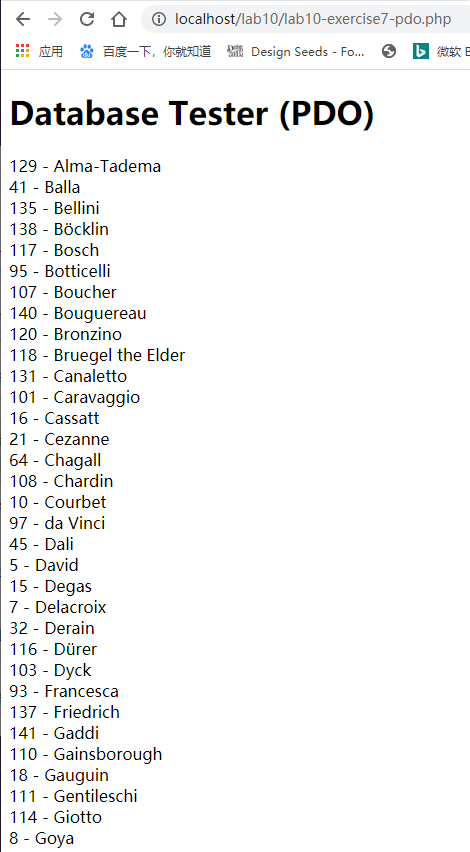
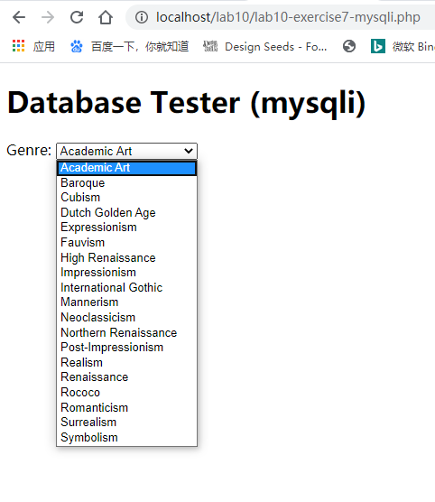
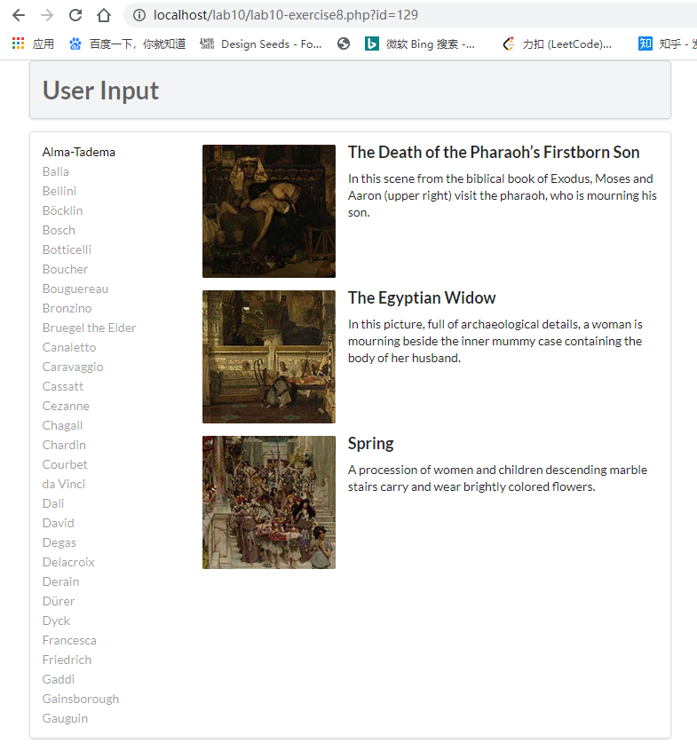

# 回答

## Exercise 7

PDO 和 MySQLi 都能便捷地连接数据库，但是 PDO 能支持更多的数据库，而 MySQLi 只能连接 mysql 数据库

1. PDO

```php
<?php
  try {
    // 连接数据库
    $pdo = new PDO(DBCONNSTRING,DBUSER,DBPASS); 
    // 设置设置错误处理 
    $pdo->setAttribute(PDO::ATTR_ERRMODE, PDO::ERRMODE_EXCEPTION);  
    $sql = "select * from Artists order by LastName";
    // 使用 SQL 语句查询数据库
    $result = $pdo->query($sql);
    // 获取查询结果的每一行
    while ($row = $result->fetch()) {
      // 打印数据 
      echo $row['ArtistID'] . " - " . $row['LastName'] . "<br/>"; 
    }
    // 关闭数据库连接
    $pdo = null; 
  }catch (PDOException $e) { 
    // 发生错误，打印消息并退出脚本
    die( $e->getMessage() );
  }
?>
```
以上代码查询了 Artists 表中的所有数据，并按 LastName 字段的字母顺序排列。

结果如图：



2. MySQLi

```php
<?php
  // 连接数据库
  $connection = mysqli_connect(DBHOST, DBUSER, DBPASS, DBNAME); 
  // 判断是否连接失败
  if ( mysqli_connect_errno() ) {
    // 打印连接失败消息并退出脚本
    die( mysqli_connect_error() ); 
  }
  $sql = "select * from Genres order by GenreName";
  // 使用 SQL 语句查询数据库
  if ($result = mysqli_query($connection, $sql)) {
    // 获取查询结果的每一行
    while($row = mysqli_fetch_assoc($result)) {
      // 生成 option HTML 代码
      echo '<option value="' . $row['GenreID'] . '">'; 
      echo $row['GenreName'];
      echo "</option>";
    }
    // 释放内存
    mysqli_free_result($result); 
  }
  // 关闭连接
  mysqli_close($connection);
?>
```

以上代码查询了 Genres 表中的所有数据，并按 GenreName 字段的字母顺序排列。

结果如图：



## Exercise 8
```php
// 连接数据库，按 LastName 字段以字母顺序查询 Artists 表中前 30 个数据
// 然后将数据转化成 HTML 的 a 标签
function outputArtists()
// 连接数据库，查询 Artists 表中 ArtistId 字段与 URL query 的 id 字段的值相同的数据 
// 然后调用 outputSinglePainting 函数
// 传入 $row 数据, 将数据转化成 HTML 语句
function outputPaintings()
// 获取数据，将数据转化成图片、标题、描述等 HTML 语句
function outputSinglePainting($row)
```

结果如图：



## Exercise 9

在PDO中，我们可以使用三种方式来执行SQL语句，分别是 `exec()` 方法，`query()` 方法，以及预处理语句 `prepare()` 和 `execute()` 方法

1. `exec()`
`exec()` 方法返回执行 SQL 语句后受影响的行数，其语法格式如下：
```php
int PDO::exec(string statement)
```
参数 `statement` 是要执行的 SQL 语句，该方法返回执行 SQL 语句时受影响的行数，通常用于 INSERT，DELETE 和 UPDATE 语句中。

2. `query()`
`query()` 方法用于返回执行查询后的结果集，该函数的语法格式如下如下：
```php
PDOStatement PDO::query(string statement)
```
参数 `statement` 是要执行的 SQL语句，它返回的是一个 `PODStatement` 对象，内容是查询后的数据

> *注意:*
> 
> 1、query 和 exec 都可以执行所有的 sql 语句，只是返回值不同而已。
>
> 2、query 可以实现所有 exec 的功能。
>
> 3、当把 select 语句应用到 exec 时，总是返回 0
>
> 4、如果要看查询的具体结果，可以通过 foreach 语句完成循环输出

3. `prepare()` 和 `execute()`

预处理语句包括 `prepare()` 和 `execute()` 两种方法。首先，通过 `prepare()` 方法做查询准备工作，然后通过 `execute()` 方法执行查询，并且还可以通过 `bindParam()` 方法来绑定参数给 `execute()` 方法，语法如下：
```php
PDOStatement PDO::prepare(string statement[,array driver_options])
bool PDOStatement::execute([array input_parameters])
```

在 PDO 中通过预处理语句 `prepare()` 和 `execute()` 执行SQL查询语句，使用循环语句把数据循环出来

## Exercise 10


```php
/*
  连接数据库，按 GenreID 字段以数字顺序查询 Genres 表中的数据，
  数据只按 GenreId, GenreName, Description 字段获取，没有其他多余字段
*/
function outputGenres() {
   try {
      $pdo = new PDO(DBCONNSTRING,DBUSER,DBPASS);
      $pdo->setAttribute(PDO::ATTR_ERRMODE, PDO::ERRMODE_EXCEPTION);
               
      $sql = 'select GenreId, GenreName, Description from Genres Order By GenreID';
      $result = $pdo->query($sql); 
      
      while ($row = $result->fetch()) {
        // 数据传给 outputSingleGenre 函数处理
        outputSingleGenre($row); 
      }

      $pdo = null;
   }
   catch (PDOException $e) {
      die( $e->getMessage() );
   }
}

/*
  获取数据，将数据转化成 图片、标题 等 HTML 语句
*/
function outputSingleGenre($row) {
   echo '<div class="ui fluid card">';
   echo '<div class="ui fluid image">';
   $img = ''; 
   // 调用 constructGenreLink 函数
   echo constructGenreLink($row['GenreId'], $img);
   echo '</div>';
   echo '<div class="extra">';
   echo '<h4>';
   // 调用 constructGenreLink 函数
   echo constructGenreLink($row['GenreId'], $row['GenreName']);
   echo '</h4>';
   echo '</div>'; // end class=extra
   echo '</div>'; // end class=card
}

/* 
  获取 $id 和任意数据 $label
  给 $label 包一个 a 标签，a 的超链接需要 $id 生成
*/
function constructGenreLink($id, $label) {
   $link = '<a href="genre.php?id=' . $id . '">'; 
   $link .= $label;
   $link .= '</a>';
   return $link;
}
```

结果如图：

