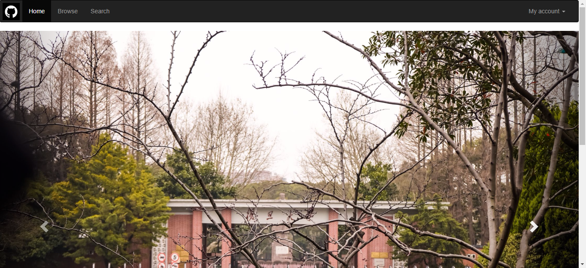
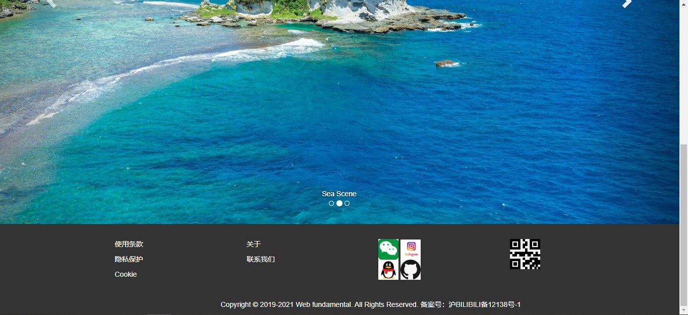

Lab4设计文档
==========
本次lab主要采用bootstrap提供的样式实现轮播功能，该文档说明的主要内容也是针对采用的bootstrap样式来叙述

-------------------

## css说明
这里主要用到的bootstrap版本为3.3.7，同时index.css也起到了重要的作用

-------------------

## 导航栏
导航栏主要用到了navbar navbar-inverse这个类型，同时对导航栏内容进行区分，可以分为logo部分、主体部分和我的账号部分。

logo部分采用了navbar-brand的类型，同时为图片添加了来源、跳转链接和40px的大小样式，还对alt进行了设置。

主体部分采用了nav navbar-nav的类型，将Home高亮显示，对Home/Browse/Search三者都进行了跳转链接的设置。

我的账号部分采用了nav navbar-nav nav-pills navbar-right的类型，鼠标左键点击后会产生下拉框，里面包含了Upload/My photo/My Favorite/Log In四项内容，对鼠标移动到的位置背景颜色也有不同显示，同时也对四项内容进行了跳转链接的设置。

-------------------

## 轮播图
轮播图部分是这个lab的核心内容部分，这里主要采用了carousel slide类型实现轮播这里主要有三张图片，三张图片进行轮播设置，分别是Fudan University/Sea Scene/Sky Scene，三张图片间隔固定的时间进行切换，也可以通过点击图片两边的按钮实现图片切换，图片的下方也有图片标题和当前图片的显示，鼠标移动到左右两边的切换按钮时会有背景颜色的变换，方便用户识别。

-----------------

## 页脚
页脚左半边主要是使用条款、隐私保护、Cookie、关于、联系我们的显示，这些内容都以链接形式设置，但这边没有设置跳转目标

页脚右半边是对一些第三方应用的显示，有wechat/qq/ins/github这四项，均以设置好40px的图片样式展示，同时最右边还有一个微信二维码的图片显示。

页脚最下端是一个公司文字信息的显示。

-----------------

## 作业效果图

如下：

