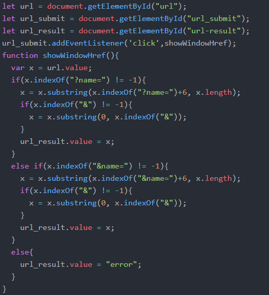
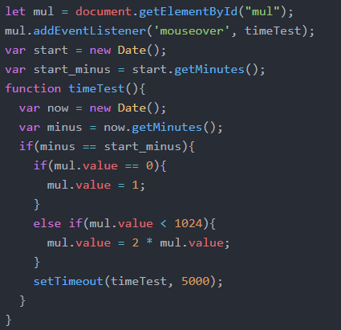
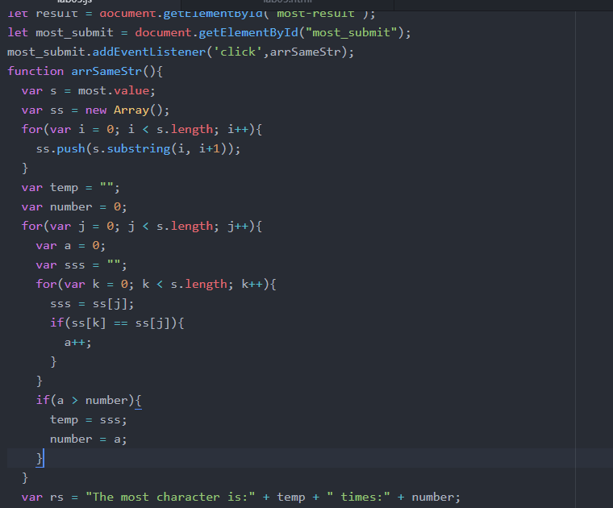
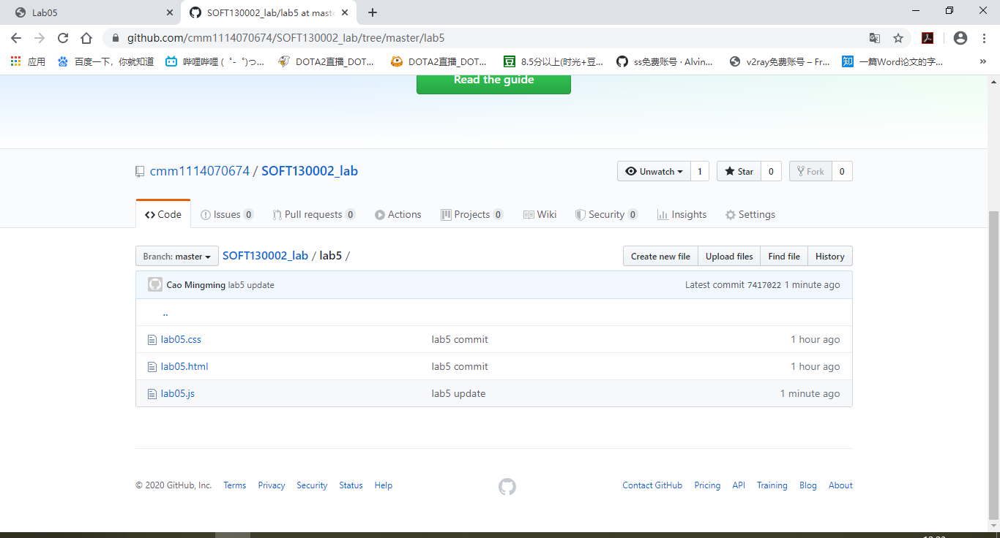
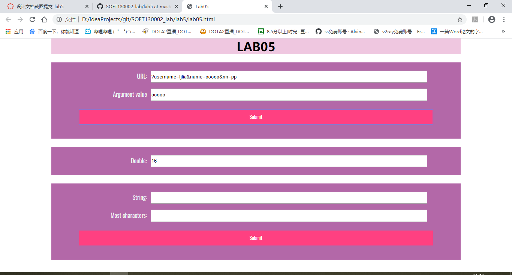
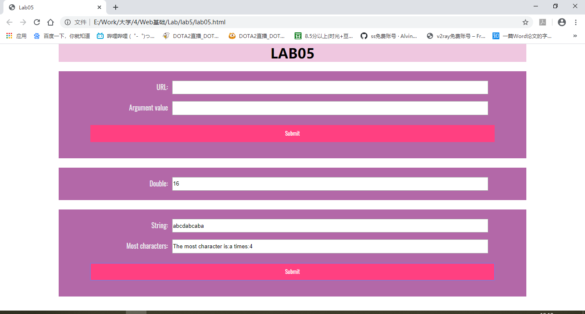

Lab5设计文档
==========
16307130079 曹铭明

-------------------

## 获取url中名为name的参数
首先要对字符串中是否含有name进行判断，同时不仅仅是name就行了，由于是链接，name前面不是?就是&，同时要排除name是一个字符串一部分的情况，例如?username=，因此判断的依据是是否含有?name=或者&name=。当不存在时，直接输出error；存在时，再对=后面的内容提取，如果后面没有&结尾，则=后面的内容全部都是参数内容，但如果存在&，那么从=到第一个&之间的内容即为参数内容。

-------------------

## 每隔五秒运行一次函数直到某一整分钟停止
这部分先添加了addEventListener的方法，添加了mouseover的触发。同时要获取开始时的min信息，在每运行一次时都要比较一下当前min信息，如果已经到了下一个一分钟，那么就停止，否则继续运行。运行时最多10次，即value最大变为1024，因此超过1024时不再运行，还要设置一个时间间隔为5s，让每次运行中间存在5s的停顿。

-------------------

## 判断输入框most里出现最多的字符
这部分内容首先需要将读取的字符串保存到Array(list)中，将每个字符信息分开保存，随后对list遍历，依次统计出每个字符出现的次数，当前出现次数最多的字符保存到一个temp中，次数保存到number中，随后如果出现次数更多的字符，就更新temp和number，否则不变，最终将运行完成后的temp和number进行输出。

-----------------

## 网页截图

如下：

